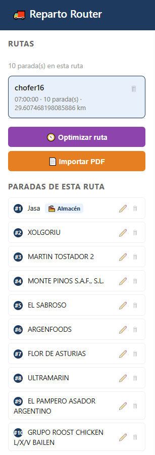
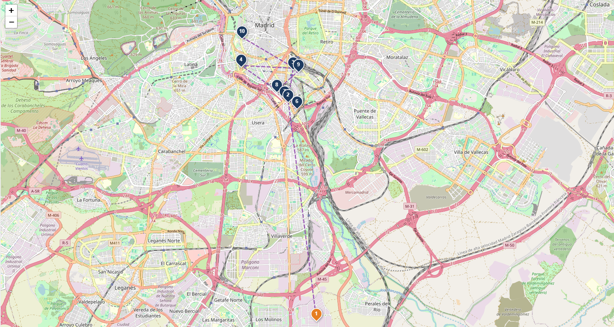
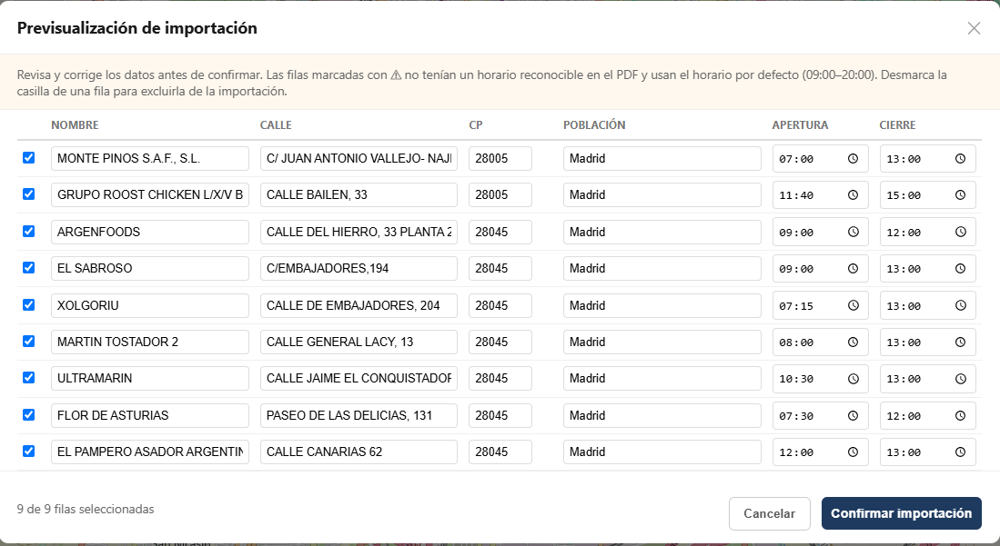

# 🚚 Reparto Router — Web

Versión web de **Reparto Router**, una aplicación para la planificación y optimización de rutas de reparto. Este proyecto es una reconstrucción completa, desde cero, de la [versión de escritorio (JavaFX)](https://github.com/Dev-Junior2026/reparto-router) del mismo sistema, usando una arquitectura cliente-servidor con backend en Spring Boot y frontend en HTML/CSS/JavaScript puro con mapas interactivos Leaflet.

Ambos proyectos se mantienen completamente independientes: la versión de escritorio es la aplicación original y funcional; esta versión web es una pieza de portfolio que demuestra la migración de esa misma lógica de negocio a un stack moderno cliente-servidor.

---

## 📋 Índice

- [Funcionalidades](#-funcionalidades)
- [Capturas](#-capturas)
- [Arquitectura](#-arquitectura)
- [Stack tecnológico](#-stack-tecnológico)
- [Instalación](#-instalación)
- [Uso](#-uso)
- [Endpoints de la API](#-endpoints-de-la-api)
- [Motor de optimización](#-motor-de-optimización)
- [Roadmap](#-roadmap)
- [Autor](#-autor)

---

## ✨ Funcionalidades

- **Gestión de rutas**: crear, listar y eliminar rutas de reparto, cada una con su propio almacén (punto de carga/descarga) asignado automáticamente al crearla.
- **Gestión de paradas**: añadir, editar y eliminar paradas dentro de una ruta, con geocodificación automática de direcciones mediante [Nominatim (OpenStreetMap)](https://nominatim.org/).
- **Mapa interactivo**: visualización en tiempo real de las paradas sobre un mapa Leaflet, con marcadores numerados según el orden de visita y una polilínea que traza el recorrido calculado.
- **Optimización de rutas**: algoritmo del vecino más cercano que decide el orden óptimo de visita priorizando la hora de apertura de cada parada (para minimizar tiempos de espera del repartidor), usando la distancia como criterio de desempate.
- **Importación desde PDF**: extracción automática de tablas de reparto en formato PDF (usando `tabula-java`), con una pantalla de previsualización editable antes de confirmar la importación — permite corregir direcciones mal formateadas antes de geocodificarlas.
- **Configuración global**: panel para ajustar valores por defecto (hora de inicio de jornada sugerida, tiempo de descarga por parada, navegador preferido para indicaciones).
- **Enlaces de navegación**: cada parada del mapa incluye un enlace directo para abrir su ubicación en Google Maps o Waze, según preferencia configurada.

---

## 📸 Capturas

**Listado de rutas**



**Visualización de la ruta en el mapa (Leaflet)**



**Previsualización de importación desde PDF**



---

## 🏗️ Arquitectura

```
┌─────────────────────┐         HTTP / JSON         ┌──────────────────────────┐
│   Frontend (SPA)     │ ───────────────────────────▶ │   Backend (Spring Boot)  │
│  HTML + CSS + JS      │ ◀─────────────────────────── │   REST API                │
│  Leaflet.js            │                              │                            │
└─────────────────────┘                              └──────────┬───────────────┘
                                                                  │
                                                     ┌────────────┴────────────┐
                                                     │                          │
                                            ┌────────▼────────┐      ┌──────────▼─────────┐
                                            │   MySQL           │      │  Nominatim API      │
                                            │   (persistencia)   │      │  (geocodificación)   │
                                            └────────────────┘      └────────────────────┘
```

El frontend se sirve como recurso estático directamente desde Spring Boot (`src/main/resources/static/index.html`), evitando problemas de CORS al compartir el mismo origen que la API.

### Estructura de paquetes (backend)

```
com.repartorouter.reparto_router_web
├── algorithm/       # HeuristicaVecino, AlgoritmoDosOpt (implementado, actualmente desactivado)
├── controller/       # Controladores REST + DTOs de entrada/salida
│   └── dto/
├── model/            # Entidades JPA: Ruta, Parada, ConfiguracionReparto
├── repository/       # Interfaces Spring Data JPA
└── service/           # DistanciaService, HorarioService, GeocodificacionService, ImportadorPdfService
```

---

## 🛠️ Stack tecnológico

**Backend**
- Java 21
- Spring Boot 4 (Spring Web MVC, Spring Data JPA)
- MySQL
- Maven
- `tabula-java` + Apache PDFBox (extracción de tablas de PDF)
- Jackson (serialización JSON, con `@JsonManagedReference`/`@JsonBackReference` para romper el ciclo `Ruta` ↔ `Parada`)

**Frontend**
- HTML5 / CSS3 / JavaScript (vanilla, sin frameworks)
- [Leaflet.js](https://leafletjs.com/) para el mapa interactivo
- OpenStreetMap como proveedor de teselas

**Servicios externos**
- [Nominatim](https://nominatim.openstreetmap.org/) para geocodificación de direcciones (respetando su límite de 1 petición/segundo)

---

## ⚙️ Instalación

### Requisitos previos

- JDK 21
- Maven (o usar el wrapper incluido `mvnw` / `mvnw.cmd`)
- MySQL en ejecución local

### Pasos

1. Clona el repositorio:
   ```bash
   git clone https://github.com/Dev-Junior2026/reparto-router-web.git
   cd reparto-router-web
   ```

2. Crea la base de datos en MySQL:
   ```sql
   CREATE DATABASE reparto_router_web;
   ```

3. Configura las credenciales de conexión en `src/main/resources/application.properties`:
   ```properties
   spring.datasource.url=jdbc:mysql://localhost:3306/reparto_router_web
   spring.datasource.username=tu_usuario
   spring.datasource.password=tu_contraseña
   spring.jpa.hibernate.ddl-auto=update
   ```

4. Arranca la aplicación:
   ```bash
   ./mvnw spring-boot:run
   ```

5. Abre el navegador en:
   ```
   http://localhost:8080/index.html
   ```

---

## 🚀 Uso

1. **Crear una ruta**: pulsa "+ Nueva ruta", indica un nombre, hora de inicio y los datos del almacén (se geocodifica automáticamente y queda fijado como parada #1).
2. **Añadir paradas**: manualmente desde el formulario, o en lote importando un PDF de reparto (botón "📄 Importar PDF").
3. **Optimizar**: pulsa "🧭 Optimizar ruta" para recalcular el orden de visita según horarios de apertura y distancia.
4. **Ajustar sobre la marcha**: edita o elimina paradas individuales en cualquier momento; los totales de la ruta (distancia, hora de fin) se recalculan automáticamente.

---

## 🔌 Endpoints de la API

| Método | Endpoint | Descripción |
|---|---|---|
| `GET` | `/api/rutas` | Lista todas las rutas |
| `POST` | `/api/rutas` | Crea una ruta vacía |
| `GET` | `/api/rutas/{id}` | Obtiene una ruta con sus paradas |
| `PUT` | `/api/rutas/{id}` | Actualiza datos de una ruta |
| `DELETE` | `/api/rutas/{id}` | Elimina una ruta y sus paradas |
| `POST` | `/api/rutas/{id}/paradas` | Añade una parada (geocodifica automáticamente) |
| `GET` | `/api/rutas/{id}/paradas` | Lista las paradas de una ruta, ordenadas |
| `PUT` | `/api/rutas/{id}/paradas/{paradaId}` | Edita una parada (re-geocodifica si cambia la dirección) |
| `DELETE` | `/api/rutas/{id}/paradas/{paradaId}` | Elimina una parada (protegido para el almacén) |
| `POST` | `/api/rutas/{id}/optimizar` | Recalcula el orden óptimo de visita |
| `POST` | `/api/rutas/{id}/importar-pdf` | Extrae filas de un PDF (previsualización, sin guardar) |
| `POST` | `/api/rutas/{id}/confirmar-importacion` | Guarda las filas revisadas del PDF como paradas |
| `GET` / `POST` / `PUT` / `DELETE` | `/api/configuraciones` | CRUD de configuración global |

---

## 🧠 Motor de optimización

El cálculo de rutas se basa en una heurística del **vecino más cercano**, adaptada con un criterio de negocio específico:

> En cada paso, se elige la parada pendiente cuya **hora de apertura sea más temprana**. Si dos o más paradas abren a la misma hora, se desempata por la **distancia más corta** desde la posición actual.

Esta decisión de diseño prioriza minimizar los tiempos de espera del repartidor (llegar a una parada antes de que abra implica esperar) por encima de la ruta puramente más corta en kilómetros.

El proyecto también incluye una implementación completa del **algoritmo 2-Opt** (`AlgoritmoDosOpt`), migrada desde la versión de escritorio, que refina el resultado del vecino más cercano minimizando la distancia total mediante intercambio de segmentos. Actualmente está **desactivada** en el flujo de optimización, ya que al operar puramente por distancia podría deshacer el orden por horarios que se prioriza como criterio de negocio. Queda disponible en el código para una futura combinación de ambos criterios.

---

## 🗺️ Roadmap

- [ ] Despliegue en un proveedor cloud con URL pública
- [ ] Pantalla dedicada de configuración (actualmente en un modal simple)
- [ ] Reactivar `AlgoritmoDosOpt` como refinamiento opcional combinable con el criterio de horarios
- [ ] Tests automatizados (actualmente verificado manualmente vía Postman a lo largo del desarrollo)

---

## 👤 Autor

**Luis Pacheco** — Estudiante de DAM (Desarrollo de Aplicaciones Multiplataforma)
GitHub: [@Dev-Junior2026](https://github.com/Dev-Junior2026)

Proyecto desarrollado como pieza de portfolio, complementario a la [versión de escritorio de Reparto Router](https://github.com/Dev-Junior2026/reparto-router).
